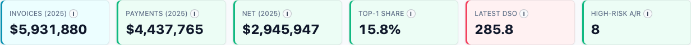
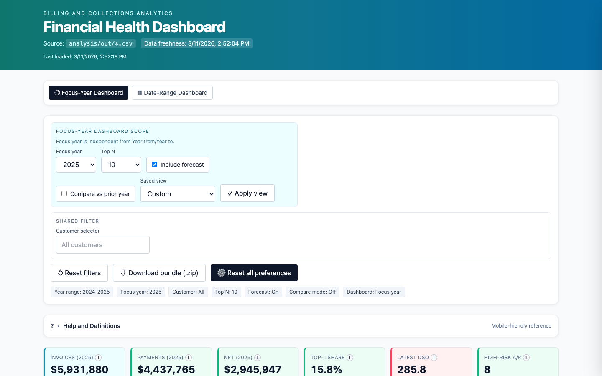
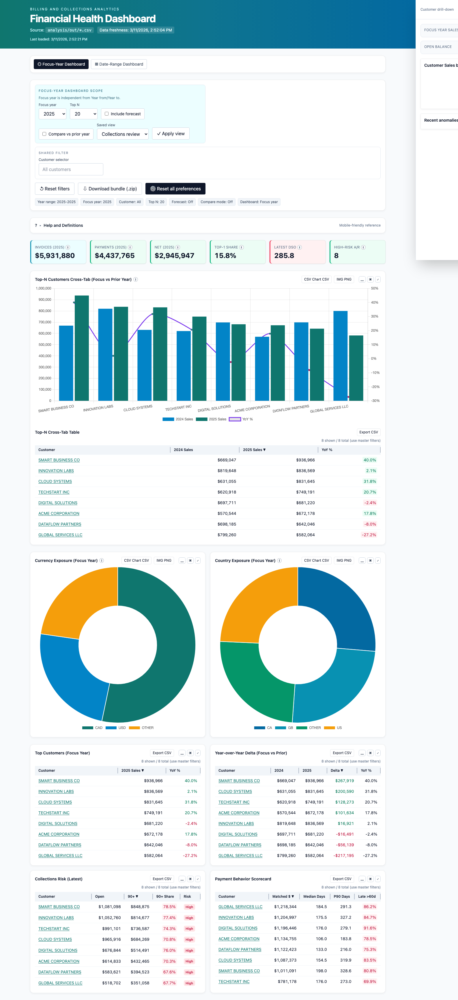
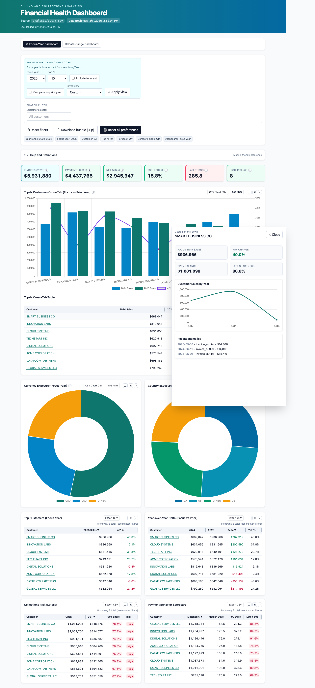

# Billing Intelligence Dashboard

[](https://github.com/joshuascottpaul/billing-dashboard-project/actions/workflows/ci.yml)
[](https://github.com/joshuascottpaul/billing-dashboard-project/releases)
[](https://github.com/joshuascottpaul/homebrew-tap)
[](LICENSE)

> **Executive dashboard for billing analytics, collections risk, and customer concentration analysis**

---

## Who Is This For?

- **CFOs / Finance Directors** - Executive view of billing health and cashflow risk
- **Controllers** - Monthly close analysis and reconciliation
- **Collections Managers** - A/R aging, DSO tracking, and risk identification
- **Analysts** - Deterministic, reproducible billing analytics
- **Developers** - Extensible SQL-first analytics pipeline

---

## Why Use This Dashboard?

| Problem | Solution |
|---------|----------|
| **Cashflow risk hidden in spreadsheets** | A/R aging, DSO trends, and collections alerts at a glance |
| **Customer concentration blind spots** | See dependency on top customers with Pareto analysis |
| **Monthly reporting is manual** | Drop in new Excel file, get instant insights |
| **Dashboard tools require setup** | Works with your existing billing exports - no configuration |
| **Metrics vary by analyst** | Deterministic SQL pipeline ensures consistent results |

---

## Quick Start

### Try It Now (5 Minutes)

```bash
# Clone repository
git clone https://github.com/joshuascottpaul/billing-dashboard-project.git
cd billing-dashboard-project

# Copy sample data (5,000 rows of fake billing data - included)
cp nc-2002-2026-sample.xlsx nc-2002-2026.xlsx

# Run analytics pipeline (creates 23 CSV outputs)
bash analysis/run.sh

# Open dashboard in browser
open dashboard/index.html
```

**If browser blocks CSV loading**, run a local server:

```bash
python3 -m http.server 8000
open http://localhost:8000/dashboard/
```

---

## Table of Contents

- [Who Is This For?](#who-is-this-for)
- [Why Use This Dashboard?](#why-use-this-dashboard)
- [Quick Start](#quick-start)
- [Screenshots](#screenshots)
- [Features](#features)
- [Installation](#installation)
- [Usage](#usage)
- [Data Files](#data-files)
- [Testing](#testing)
- [FAQ](#faq)
- [Documentation](#documentation)
- [Contributing](#contributing)

---

## Screenshots

### Default Overview


*Full dashboard view showing KPIs, charts, and tables with default 2024-2025 date range.*

### KPI Cards with Risk Indicators



*6 key metrics with color-coded risk indicators (🟢 healthy, 🟡 monitor, 🔴 action needed).*

### Interactive Charts



*9 charts including concentration trends, invoice drift, retention cohorts, and exposure analysis.*

### Collections Risk View



*Collections Review preset shows A/R aging buckets and high-risk customers.*

### Customer Drill-Down



*Click any customer name to see their sales trend, open balance, and anomalies.*

---

## Features

### 📊 Analytics Pipeline

**4 SQL stages** (DuckDB) process your billing data into **23 output files**:

| Stage | Purpose | Outputs |
|-------|---------|---------|
| **Ingest** | Normalize dates, currencies, customer names | Cleaned facts table |
| **Quality** | Missingness, constant columns, anomalies | Quality report (MD) |
| **Metrics** | Summaries, concentration, lifecycle | 8 CSV files |
| **Advanced** | A/R aging, DSO, forecasting, reconciliation | 14 CSV files |

**Key outputs:**
- Yearly/monthly summaries
- Customer concentration (Pareto analysis)
- A/R aging and DSO metrics
- Payment behavior scorecards
- Retention/churn cohorts
- Anomaly detection (outliers, spikes, bursts)
- Forecast baseline
- Reconciliation reports

### 📈 Executive Dashboard

**Single-file HTML dashboard** (no build required):

- **6 KPI cards** with risk indicators (🟢🟡🔴)
- **9 interactive charts** (Chart.js)
- **6 sortable/resizable tables**
- **Global filter bar** with preset views
- **Customer drill-down** drawer
- **Export capabilities** (CSV, PNG, ZIP bundle)
- **Bookmarkable URLs** with state preservation

### 🧪 Automated Testing

- **12 E2E tests** (Playwright) - dashboard load, filters, exports, URL state
- **16 unit tests** - task generator validation
- **CI/CD pipeline** (GitHub Actions) - runs on every push/PR

### 🤖 Automation

- **Task generator** - `tasks.yaml` → `TASKS.md` with validation
- **Schema validation** - fails fast with actionable error messages
- **Auto-updating Homebrew formula** - on release publish
- **DORA metrics tracking** - deployment frequency, lead time, failure rate, MTTR

---

## Installation

### Option 1: Homebrew (macOS/Linux)

```bash
# Install Homebrew if needed
/bin/bash -c "$(curl -fsSL https://raw.githubusercontent.com/Homebrew/install/HEAD/install.sh)"

# Tap repository
brew tap joshuascottpaul/homebrew-tap

# Install billing-dashboard
brew install billing-dashboard

# Verify installation
billing-dashboard version
```

### Option 2: From Source

**Install requirements:**

```bash
# macOS (using Homebrew)
brew install python@3.14 node duckdb

# Linux (using apt)
sudo apt install python3 python3-pip nodejs
pip3 install duckdb pandas openpyxl

# Or install DuckDB from: https://duckdb.org/docs/installation
```

**Clone and setup:**

```bash
git clone https://github.com/joshuascottpaul/billing-dashboard-project.git
cd billing-dashboard-project

# Install Node dependencies (for E2E tests)
npm install

# Run analytics
bash analysis/run.sh

# Run tests (optional)
npm run test:e2e
```

---

## Usage

### CLI Commands

| Command | Description |
|---------|-------------|
| `billing-dashboard run` | Run analytics pipeline |
| `billing-dashboard serve [--port PORT]` | Start dashboard server (default: 8000) |
| `billing-dashboard generate` | Generate TASKS.md from tasks.yaml |
| `billing-dashboard test` | Run E2E test suite |
| `billing-dashboard version` | Show version |
| `billing-dashboard help` | Show help |

### Dashboard Filters

| Filter | Description | Example |
|--------|-------------|---------|
| **Year from/to** | Time window for charts | 2024 → 2025 |
| **Focus year** | KPI year + YoY comparison | 2025 |
| **Customer** | Filter all tables by name | Acme Corporation |
| **Top N** | Number of customers in Top-N | 10 |
| **Include forecast** | Show/hide forecast on monthly chart | ✓ / ✗ |
| **Compare vs prior year** | Add YoY comparison to KPIs | ✓ / ✗ |
| **Saved view** | Quick presets | Default, Collections, Growth, Risk |

### URL State (Bookmarkable)

Dashboard state is preserved in URL params:

```
http://localhost:8000/dashboard/?yf=2024&yt=2025&fy=2025&n=10&fc=0&cm=0
```

| Param | Description | Example |
|-------|-------------|---------|
| `yf` | Year from | `2024` |
| `yt` | Year to | `2025` |
| `fy` | Focus year | `2025` |
| `n` | Top N customers | `10` |
| `fc` | Include forecast (0/1) | `0` |
| `cm` | Compare mode (0/1) | `0` |

---

## Data Files

### Sample Data (Included)

**File:** `nc-2002-2026-sample.xlsx`

| Property | Value |
|----------|-------|
| **Rows** | 5,000 |
| **Date range** | 2024-01-01 to 2026-02-28 |
| **Total invoices** | ~$9.5M |
| **Companies** | 8 fake companies |
| **Safe to share** | ✅ No sensitive information |

```bash
# Use sample data (recommended for testing)
cp nc-2002-2026-sample.xlsx nc-2002-2026.xlsx
bash analysis/run.sh
```

### Production Data (Not Included)

**File:** `nc-2002-2026.xlsx`

- Your actual billing data exported from accounting system
- **NOT included** in repository (contains sensitive data)
- Must match the required schema below

### Source Schema

**Required columns:**

| Column | Description | Example |
|--------|-------------|---------|
| `Invoice Date` | Event date for all transactions | `2025-03-15 10:30:00` |
| `Statement Item Type` | Transaction class | `Invoice`, `Payment`, `Credit` |
| `Invoice Grand Total` | Invoice/credit amount | `1500.00` |
| `Amount of Payment` | Payment amount | `1500.00` |
| `Billing Company` | Primary customer identity | `Acme Corporation` |
| `Billing Contact` | Fallback customer identity | `John Doe` |
| `Billing Contact Address Email` | Final fallback identity | `billing@acme.com` |
| `Currency` | Currency code | `CAD`, `USD`, `EUR` |
| `Billing Country` | Country code | `CA`, `US`, `GB` |

**Optional columns:** `Payment Method`, `Work Order Number`, `Tax GST`, `Sub Total`, `Total Invoice`, `Total of Payments`, `Total Outstanding`

See [`analysis/README.md`](analysis/README.md) for full schema documentation and remediation steps.

---

## Testing

### Run All Tests

```bash
# E2E tests (headless browser)
npm run test:e2e

# Unit tests (task generator)
python tests/test_tasks_generator.py

# CI sync check
./scripts/check_tasks_sync.sh
```

### Test Coverage

| Test Type | Count | Coverage |
|-----------|-------|----------|
| **E2E** | 12 | Dashboard load, filters, presets, exports, URL state, customer drill-down |
| **Unit** | 16 | Task generator formatting, validation, edge cases (unicode, nulls, long fields) |
| **Schema** | Auto | tasks.yaml validation on every generation |

---

## FAQ

### Getting Started

**Q: How do I try the dashboard with sample data?**

**A:** Copy the included sample file and run:

```bash
cp nc-2002-2026-sample.xlsx nc-2002-2026.xlsx
bash analysis/run.sh
open dashboard/index.html
```

---

**Q: Browser blocks CSV loading with "Failed to fetch" error**

**A:** Use a local server instead of `file://`:

```bash
python3 -m http.server 8000
open http://localhost:8000/dashboard/
```

---

**Q: Dashboard shows no data**

**A:** Run the analytics pipeline first:

```bash
bash analysis/run.sh
```

Then refresh the dashboard.

---

### Data & Schema

**Q: Schema validation fails - missing columns**

**A:** Check that your Excel file has all required columns:

```bash
bash analysis/run.sh
```

The error message will list:
- Missing columns
- Available columns in your file
- Remediation steps

---

**Q: How do I update the dashboard with new data?**

**A:** Replace the Excel file and re-run:

```bash
# 1. Export new billing data to nc-2002-2026.xlsx
# 2. Ensure schema matches required columns
# 3. Run analytics
bash analysis/run.sh
```

---

### Installation

**Q: Homebrew install fails**

**A:** Try installing dependencies first:

```bash
brew install python@3.14 node duckdb
brew install billing-dashboard
```

---

**Q: Playwright tests fail**

**A:** Install browsers:

```bash
npx playwright install --with-deps chromium
```

---

### Customization

**Q: Can I customize the dashboard?**

**A:** Yes! Edit `dashboard/index.html`:
- Styling: Tailwind CSS classes
- Charts: Chart.js configuration
- Data loading: Vanilla JavaScript (no framework)

---

**Q: How do I add new metrics?**

**A:**
1. Add SQL in `analysis/03_metrics.sql` or `04_advanced_analysis.sql`
2. Add export in `analysis/run.sh`
3. Update `dashboard/index.html` to read new CSV
4. Add glossary entry in `docs/DASHBOARD_GLOSSARY.md`

---

## Documentation

| Document | Purpose |
|----------|---------|
| [`STRATEGIC_INTENT.md`](STRATEGIC_INTENT.md) | Project goals, scope, decision principles |
| [`OVERVIEW.MD`](OVERVIEW.MD) | Multi-agent orchestration model |
| [`OUTCOMES.md`](OUTCOMES.md) | DORA metrics and reporting |
| [`analysis/README.md`](analysis/README.md) | Pipeline runbook and output catalog |
| [`dashboard/README.md`](dashboard/README.md) | Dashboard user guide |
| [`docs/DASHBOARD_GLOSSARY.md`](docs/DASHBOARD_GLOSSARY.md) | KPI/chart/table definitions |
| [`CHANGELOG.md`](CHANGELOG.md) | Release notes |
| [`IMPROVEMENTS.md`](IMPROVEMENTS.md) | Tech debt backlog |

---

## Contributing

1. Fork the repository
2. Create a feature branch (`git checkout -b feature/amazing-feature`)
3. Commit changes (`git commit -m 'Add amazing feature'`)
4. Push to branch (`git push origin feature/amazing-feature`)
5. Open a Pull Request

### PR Requirements

- [ ] Tests pass (`npm run test:e2e`, `python tests/test_tasks_generator.py`)
- [ ] `TASKS.md` in sync (`python scripts/generate_tasks.py --check`)
- [ ] `CHANGELOG.md` updated
- [ ] `docs/DASHBOARD_GLOSSARY.md` updated (if dashboard changed)

See [`.github/PULL_REQUEST_TEMPLATE.md`](.github/PULL_REQUEST_TEMPLATE.md) for full template.

---

## Get Started

1. **Try it now:** Clone and run with sample data (see [Quick Start](#quick-start))
2. **Read the docs:** See [`dashboard/README.md`](dashboard/README.md) for detailed usage
3. **Report issues:** Found a bug? [Open an issue](https://github.com/joshuascottpaul/billing-dashboard-project/issues)

---

## License

MIT License - see [LICENSE](LICENSE) for details.

---

## Links

- **Main Repository:** https://github.com/joshuascottpaul/billing-dashboard-project
- **Homebrew Tap:** https://github.com/joshuascottpaul/homebrew-tap
- **Issues:** https://github.com/joshuascottpaul/billing-dashboard-project/issues
- **Releases:** https://github.com/joshuascottpaul/billing-dashboard-project/releases

---

*Built with DuckDB, Chart.js, Tailwind CSS, and Playwright*
